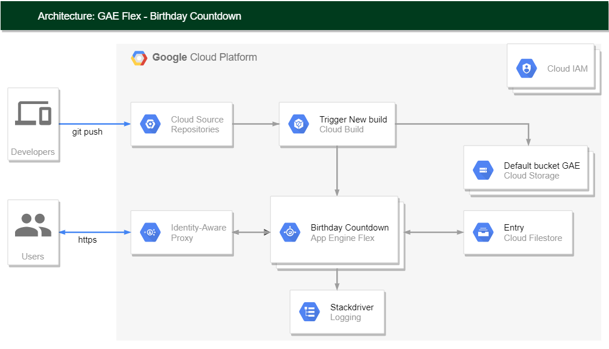

## Birthday Countdown - GAE Flex | Google Cloud Firestore
Inspired by a multitude of sources available on the Net, this Python application runs a simple interface in Google AppEngine Flexible to add/edit/delete users in Google Firestore and offers a birthday countdown feature.

### Content
```Text
.gitignore                      ** Common .gitignore file
README.md                       ** This file contains some information about the application
CHANGELOG.md                    ** Changelog file
BC_diagram.PNG                  ** Architecture diagram
cloudbuild.yaml                 ** YAML file for CI/CD via Cloud Build
countdown/                      ** This folder contains the application code
    |______ main.py             ** Main script
            firestore.py        ** Firestore script
            requirements.txt    ** Requirements file for dependencies
            app.yaml            ** YAML file for GAE deployment
            templates/          ** This folder contains the HTML templates
```

### Diagram



## Prerequisites
** !!! IMPORTANT: Always make sure NOT TO publish any credentials nor keys when pushing your code to a public repository !!!
* A [GCP project](https://console.cloud.google.com/) with billing account enabled.
* This project can easily be deployed within the Google Free Tier quotas for testing purpose, but ONLY YOU are responsible for the eventual costs associated to your GCP project, remember to clean-up once testing is done.
* If you already have GCP project(s), you can create a new GCP project for this demo, which you will delete in the end.

## Steps
** !!! IMPORTANT: Please note that this application will be available publicly once deployed in GAE !!!
* Please see this link to [secure your application in GAE using IAP](https://cloud.google.com/beyondcorp-enterprise/docs/securing-app-engine). The role 'IAP-secured Web App User' is required for your Google user account in order to access the application once IAP is enabled.
* Enable the necessary Google Cloud APIs when prompted during all the steps.
* Make sure the following roles/permissions are assigned to the default Google Build service account: App Engine Deployer, App Engine Admin, App Engine Service Admin, Cloud Build Service Account, Service Account User.
* Create a [Google service account](https://cloud.google.com/iam/docs/creating-managing-service-accounts) and add the proper roles/permissions: Cloud Datastore Owner, Logs Writer.
* Create a key (*.json) for this service account and make it available by exporting the environment variable GOOGLE_APPLICATION_CREDENTIALS=/path/to/key.json.
* Create a [Python virtual environment](https://cloud.google.com/python/docs/setup) and install the dependencies from requirements.txt to test the application locally.
* You can test the application locally by executing main.py and accessing it at localhost:8080 via your web browser.
* Deploy the application to [GAE Flexible](https://cloud.google.com/appengine/docs/flexible) using the app.yaml file via Google Cloud Shell for instance.
* To automate CI/CD deployment, use [Google Cloud Build triggers](https://cloud.google.com/build/docs/automating-builds/create-manage-triggers#gcloud) and [Cloud Service Repository](https://cloud.google.com/source-repositories/docs/quickstart); see the file cloudbuild.yaml.
* Enable the 'App Engine Admin API' if not already done.
* You have the possibility to configure a Google Cloud Build trigger which will deploy a new version of your application each time a commit is pushed to a specified branch in Cloud Service Repository.
* You can also use the ['--no-promote' option](https://cloud.google.com/appengine/docs/standard/python3/testing-and-deploying-your-app#testing-on-app-engine) if you want to deploy your new version without serving traffic to it.
* For splitting the traffic between versions, feel free to check [how requests are routed](https://cloud.google.com/appengine/docs/standard/python3/how-requests-are-routed). 

## Usage
* Once deployed locally or to GAE, you will be able to interact with Google Cloud Firestore and add entries.
* You can then reach the Birthday Countdown page for each entry and display the results with a simple click.

## Clean-up
* Use 'gcloud app versions stop [VERSION.ID]' to stop your GAE services and instances.
* Use 'gcloud app versions list', look at the SERVING_STATUS field and make sure all GAE versions are stopped.
* Once you are done with this demo, feel free to [delete the GCP project](https://cloud.google.com/resource-manager/docs/creating-managing-projects#shutting_down_projects) you have created for that purpose, which will destroy all the resources within this project.

 > Author: mgvux